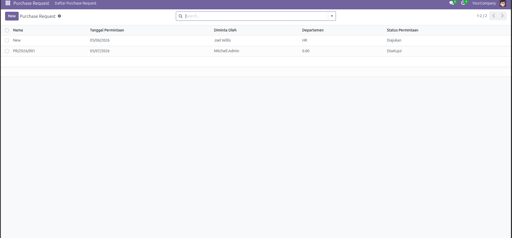
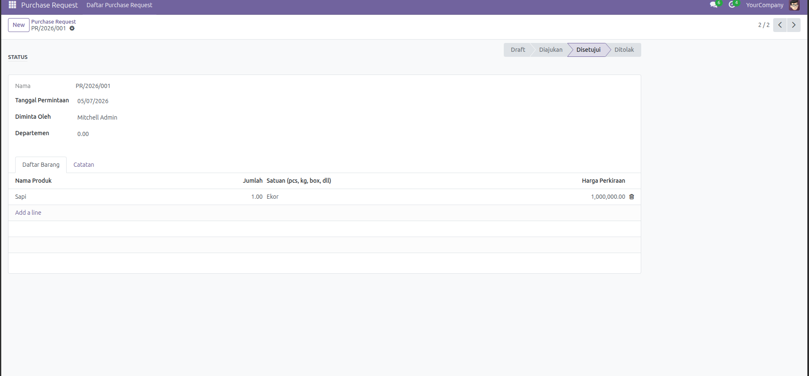
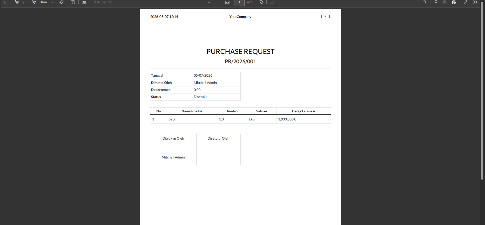

# Purchase Request Module for Odoo 17

Modul custom Odoo 17 untuk manajemen permintaan pembelian internal sebelum dibuatkan Purchase Order resmi.

## Fitur

- Form permintaan pembelian dengan nomor otomatis (PR/YYYY/001)
- Detail item yang diminta (nama produk, jumlah, satuan, harga estimasi)
- Approval workflow: Draft → Diajukan → Disetujui/Ditolak
- Validasi: tidak bisa submit tanpa line item
- PDF report dengan tanda tangan

## Teknologi

- Odoo 17 Community
- Python 3
- XML (QWeb, Views)
- PostgreSQL

## Instalasi

1. Copy folder `purchase_request` ke direktori `addons` Odoo
2. Restart Odoo server
3. Aktifkan Developer Mode
4. Apps → Update Apps List
5. Search "Purchase Request" → Install

## Struktur Modul
purchase_request/
├── manifest.py
├── init.py
├── data/
│   └── sequence.xml
├── models/
│   ├── init.py
│   ├── purchase_request.py
│   └── purchase_request_line.py
├── reports/
│   └── report_purchase_request.xml
├── security/
│   └── ir.model.access.csv
└── views/
└── purchase_request_views.xml

## Screenshot

**Daftar Purchase Request**

**Form Purchase Request**

**PDF Report**

## Author

Hussain — Undergraduate IT Student